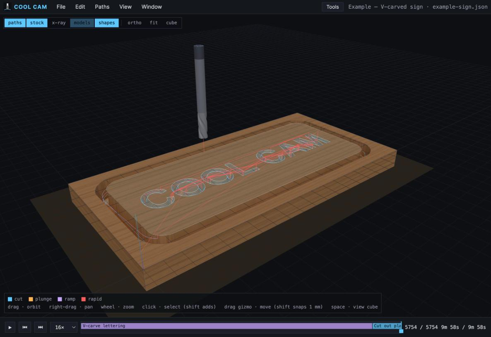
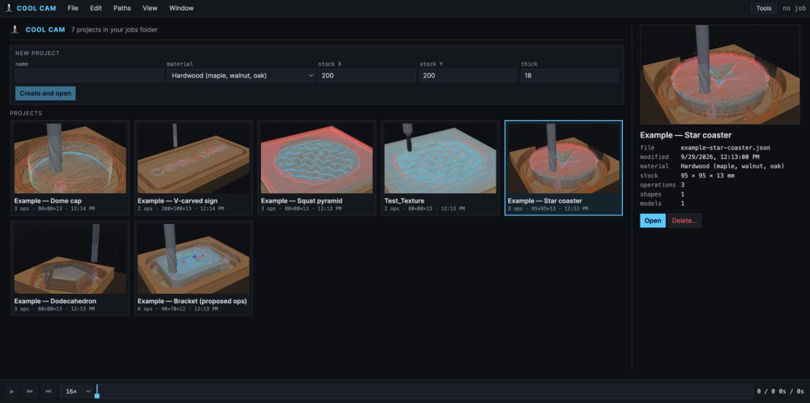
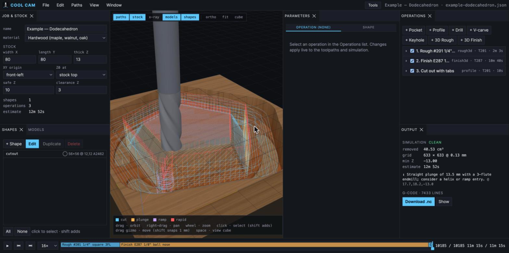
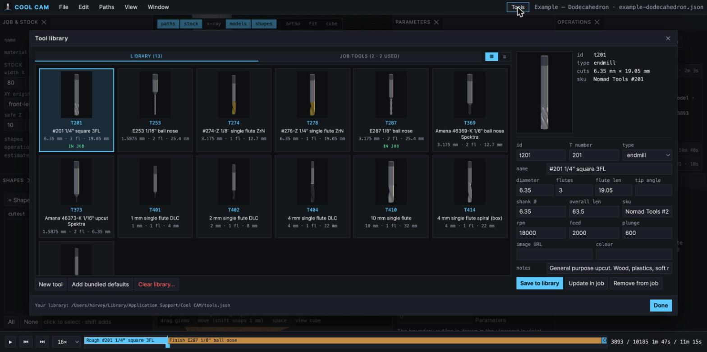
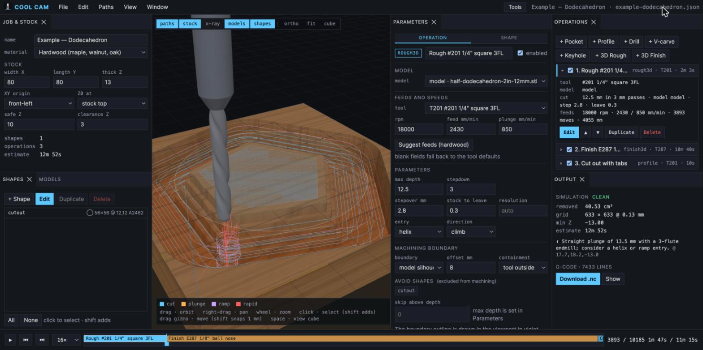
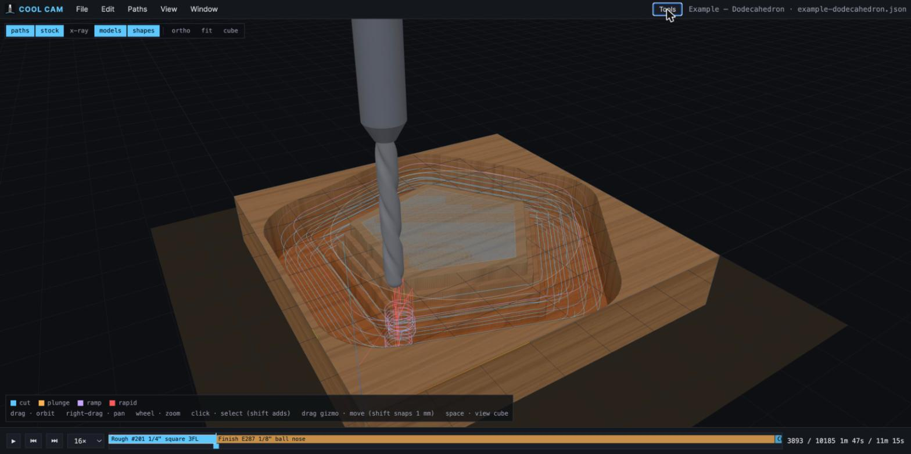
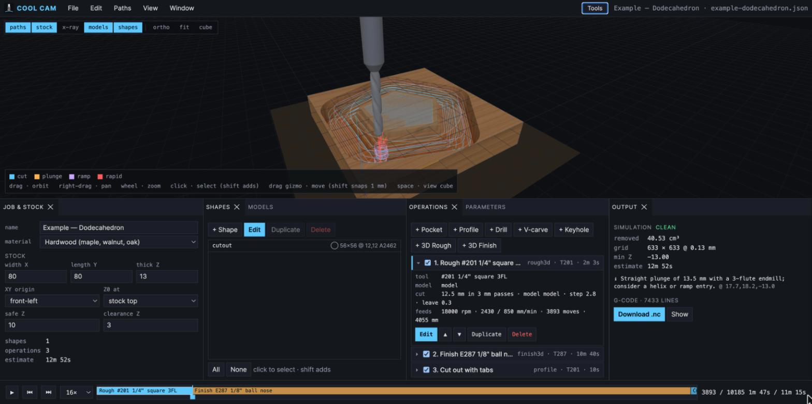

# Cool CAM

MCP-enabled, open-source 2.5D and 3D CAM for **GRBL-class CNC routers**, built as a TypeScript monorepo so Claude can drive it directly. Machine profiles cover Shapeoko, Nomad, LongMill, Onefinity, X-Carve and 3018-style machines, and you can add your own; the defaults are tuned for a Shapeoko HDM with Carbide Motion and a BitSetter.



```
packages/
  core/    geometry (Clipper offsets), DXF + SVG + STL/OBJ import, tool library, feeds & speeds,
           operations: pocket (helix/ramp/plunge entry, islands), profile (in/out/on, auto/manual tabs), drill (peck),
           3D rough (Z-level clearing of a mesh) and 3D finish (parallel raster) via heightmap drop-cutter
  post/    GRBL post: M6 T<n> or M0 tool changes (per machine profile), G53 safe moves, arc fitting
  sim/     heightmap stock-removal simulator with collision / over-depth checks and scrubbable keyframes
  mcp/     MCP server (stdio) exposing the whole pipeline as tools
  server/  local HTTP API (jobs, tool library, machines, fonts, change feed) used by the viewer, the CLI and the app
  viewer/  Vite + React + Three.js: 3D toolpaths, live stock simulation, timeline scrubber, G-code export
  desktop/ Electron shell (electron-vite + electron-builder): the viewer and the API in a window, the MCP server bundled
jobs/      project files (one JSON per project, with a thumbnail); current.json is the pointer the MCP server follows
examples/  sample drawings, STLs and the script that builds the example projects from your tool library
```

## Screenshots

| | |
|---|---|
|  |  |
| *Open screen: every project in the jobs folder with its last simulated state* | *Default layout: job and shapes on the left, operations and output on the right* |
|  |  |
| *Tool library: your cutters rendered in 3D, the same models that move in the simulation* | *Editing a 3D roughing operation: feeds, stepdown, machining boundary* |
|  |  |
| *Viewport alone: 3D rough and ball-nose finish of a half dodecahedron* | *Panels dock anywhere, e.g. a wide viewport over a row of panels; layouts can be saved from the Window menu* |

## Quick start

**Just want the app?** Download the latest macOS build from [Releases](https://github.com/harveymoon/COOL_CAM/releases). It is not code-signed yet: on first launch right-click → Open.

```bash
npm install
npm run build          # builds core, post, sim, mcp
npm test               # vitest
npm run dev            # viewer on http://localhost:5173 (browser, fastest loop)
npm run dev:desktop    # the same viewer inside an Electron window, with HMR
npm run build:viewer && npm start   # serve the built viewer to a browser (no Electron)
npm run build:desktop  # package the desktop app (dmg / nsis / AppImage), see docs/PACKAGING.md
```

### Use it from Claude Code

`.mcp.json` in this folder registers the server, so opening Claude Code here gives it the `cool-cam` tools. Rebuild after changing the TypeScript (`npm run build`).

Typical conversation:

1. `new_job` — name, stock size, material
2. `import_geometry` (DXF/SVG) or `add_shape` (rect, circle, slot, polygon)
3. `feeds_and_speeds` — starting numbers for a tool + material
4. `add_operation` — pocket / profile / drill
5. `generate` → `simulate` → `export_gcode` (refused while the simulation reports errors unless forced)

Also: `machine_info` / `set_machine` (presets or a custom profile), `library_tools`, `propose_operations` from an STL, `import_model`, `import_heightmap_image`, `add_text` / `list_fonts`, `import_paths` + a `trace` operation for ready-made tool paths, and `screenshot_viewport`, which returns a JPEG of the running viewer's 3D view (pick a camera, fit the stock) so Claude can look at the job without a browser.

Every mutation is saved to the current project; the viewer shows the change live, and if the MCP server switches to another project the viewer offers to follow rather than switching under you.

### Use it from the viewer

The viewer is a full editor sharing the same job file with the MCP server (edits in either place show up in the other).

- **Landing page**: nothing is loaded on start. Pick a project from the grid (thumbnails are captured once a project has been opened and simulated), see its preview and details, then press Open; or create a named project with its stock and material. File → Open… shows the same page while a project is open.
- **Menu bar**: File (new/open project, save as, close, reload, import DXF/SVG, 3D models, relief images and tool paths, export G-code with a timestamped name), Edit (add shape/text, shape parameters, transform, booleans, duplicate, delete, select), Paths (add any operation, sync tools), View (view cube, fit, orthographic, named views, toggles), Window (tool library, machines, show/float panels, save/recall/reset layouts).
- **Panels** dock anywhere: drag a tab to any edge or into another group, right-click a tab to float or maximize it, or use Window → Float panel. The layout is remembered; Window → Save layout stores named layouts.
- **Job & Stock**: name, material, machine (Change… opens the Machines window), stock size/origin, clearances, spoilboard allowance.
- **Shapes**: select in the list or by clicking in 3D (shift adds). Add shape and Transform open dialogs over the viewport.
- **Operations**: each op shows its tool, shapes, depth and feeds; Edit opens the **Edit operation** pane beside the viewport (dockable like any other panel) so you see the toolpaths and simulation change as you type. One-click material feeds. Reorder, enable/disable, duplicate, delete inline.
- **Tabs**: profile ops have an Auto/Manual switch. Auto spaces N tabs evenly. Manual seeds from the auto layout, then *Place tabs in 3D* lets you click the contour to add tabs and click a marker to remove one. Tab markers show in the viewport for both modes.
- **Output**: simulation verdict with clickable problem list, G-code download.
- **Tool library** (Window menu, or the Tools button in the top bar): a grid of your cutters rendered in 3D (the same models move in the simulation) with a list view; job tools vs library with usage counts. Your cutters live in your application-data folder (macOS `~/Library/Application Support/Cool CAM/tools.json`, Windows `%APPDATA%\Cool CAM\tools.json`, Linux `~/.config/cool-cam/tools.json`), shared with the MCP server and used for new jobs. The repo's `library/tools.json` is the bundled default that seeds it the first time; *Add bundled defaults* brings it back after a clear. The grid view draws each cutter from its parameters (or shows the tool's `image`), so a bit is easy to spot; the list view is the compact alternative.
- **View cube**: press Space to show a SolidWorks-style chamfered cube over the model; faces, edge bevels, and corner bevels are all clickable and animate into that orthographic view (corners give 3/4 views). View → Orthographic toggles back to perspective.
- **Move gizmo**: selecting shapes shows a translate handle in 3D; drag the X/Y arrows or the square for free XY moves. Hold Shift to snap to 1 mm. The move commits on release and regenerates toolpaths.
- **Stock texture**: the simulated stock is textured by material (wood grain, brushed metal, MDF speckle, plastics); cut floors tint warmer with depth so pockets read against the grain. Through-cuts open real holes onto a dark spoilboard drawn under the stock.
- Timeline: scrub or play the cut; clicking an operation jumps to the end of that operation.

### Mitres, through-cuts and external tool paths

- **Spoilboard allowance** (Job panel): how far below the stock bottom cuts may go. Put Z0 on the spoilboard (`Z0 at: stock bottom`) and set the allowance to plan through-cuts and mitres finished through the face; the simulator treats the spoilboard as material and only complains beyond the allowance.
- **Trace** (File → Import tool paths, then + Trace): runs ready-made 3D tool-tip paths from a generator's JSON or a 3D DXF (one layer per tool) through Cool CAM's feeds, simulation and post. With a model selected, a ball-nose path is verified against the STL by exact sphere-to-triangle distance and any gouge is reported before anything reaches the machine. DXF layers travel with the shapes, and REF layers are reference-only geometry that operations skip.

### Lettering, V-carve, keyhole, relief images

- **Text**: Edit → Add text (or `add_text` / `list_fonts` over MCP) outlines a string with any TTF/OTF on this Mac into closed shapes; counters become holes. Text shapes stay editable in the Parameters panel (string, font, size, position, alignment, spacing).
- **V-carve**: a V-bit follows successive inward offsets of a region, tip depth = offset / tan(half angle), so the groove walls sit exactly on the outline. Depth cap optional; with a *flat clearing* endmill the wide areas are pocketed flat at the cap first (advanced V-carve), emitted as a separate toolpath for that tool.
- **Keyhole**: plunge, slide the slot length at the given angle, return, retract. Add a `keyhole` tool (head + shank diameter) in the tool library.
- **Contour ramp**: profiles can enter with a ramp along the contour instead of a plunge (never through a tab).
- **Rest machining**: a pocket with *rest of* set to a larger tool only cuts what that tool could not reach.
- **Image → relief**: File → Import image as relief (or `import_heightmap_image`) turns a PNG/JPEG into a solid relief model (white = high), ready for 3D rough/finish.
- **Arcs**: the post fits G2/G3 arcs over circular runs (0.01 mm tolerance), typically shrinking files 3× on round parts. `arcs: false` disables it.

### Editing

The **Parameters** panel shows either the active operation or the selected shapes. Shape mode has the centre position, width and height with a link toggle for the aspect ratio, primitive parameters for rectangles, circles, polygons, slots and text, mirror, offset, and booleans (union, subtract, intersect). Undo/redo is ⌘Z / ⇧⌘Z. The timeline shows one segment per operation coloured by tool, with tool-change ticks and hover details; click a segment to jump to the end of that operation.

### 3D models

Import an STL or OBJ (File → Import 3D model, the Models panel, or `import_model` over MCP). The model is centred on the stock with its top at Z0; the Models panel has placement fields and snap buttons (centre, corner, top at Z0, bottom on bed, × 25.4 for inch files, fit stock). Then:

- **3D Rough**: slices the tool-offset surface every `stepdown` and clears each layer with the pocket engine (helix entry, climb). Leaves `stockToLeave` (default 0.3 mm). Use a flat endmill.
- **3D Finish**: zig-zag raster along X or Y, tool tip following the offset surface; skips air. Use a ball nose with a small stepover (10 % of diameter is a good start).

Both derive from a heightmap of the placed mesh, so the workflow is strictly 3-axis (no undercuts), which matches the machine.

**Machining boundary** (both 3D ops, "Machining boundary" section in the editor): choose the model *silhouette* (default), its *bounding box*, the *whole stock*, or *selected shapes* you drew; apply an *offset*; and pick *containment*: tool inside the boundary (default), centre on it, or tool outside. *Avoid shapes* subtract regions, and *skip above depth* is a Z window that leaves shallow surface alone. With the defaults a 3D pass touches only what is inside the model outline, so a coaster's rim is left for a tabbed profile and an engraving model's square blank never gets cut. Use containment *outside* with an offset when you want the classic moat around a free-standing carving. The boundary draws in violet in the viewport while the op is selected.

**Propose operations** (Models panel button, or `propose_operations` over MCP) analyses the mesh instead of treating it as a blob: upward-facing planar faces become exact 2.5D pocket regions at their height (largest endmill that fits, plus a rest pass with a smaller one for corners), through-holes that match a tool diameter become drills, curved faces trigger 3D rough + finish, and a part sitting on the bed gets a tabbed cutout. The proposal is appended as ordinary shapes and operations you can edit. `examples/stl/bracket-2p5d-12mm.stl` (from `examples/gen-bracket-stl.mjs`) is a plate with a pocket, a step, a counterbore and two holes for trying it. `examples/stl` holds four watertight test parts under 12 mm tall generated by `node examples/gen-test-stl.mjs`: a 2" spherical cap, a 2" face-up dodecahedron slice, a square frustum, and a coaster with a faceted star recess. Model geometry is embedded in the job file, so jobs with big meshes are a few MB. `node examples/make-example-jobs.mjs` rebuilds the example jobs for the cutters in *your* tool library, picking a 1/4" flat, a 1/8" two-flute flat, a 1/8" ball and a 60° V-bit by role (a labelled placeholder stands in for a V-bit you do not own yet).

## Conventions

- Units: mm. X0/Y0 at the stock's front-left corner by default, Z0 at stock top (BitSetter workflow).
- Depths are positive numbers below the stock top.
- Climb milling by default (material on the right of travel with a clockwise spindle).
- Tool changes follow the machine profile: `M6 T<n>` before every tool including the first (Carbide Motion prompts and probes the BitSetter), or `T<n>` + `M0` for senders that pause (gSender, UGS, bCNC, Candle). Window → Machines… picks a preset or your own numbers.
- Machine rapids and accelerations only affect time estimates; max feeds flag operations that exceed them; check them against your GRBL `$` settings.

## Roadmap

Shipped so far: 2.5D pocket/profile/drill/keyhole, V-carve with flat clearing, trace (follow imported 3D tool paths, verified exactly against the STL), spoilboard allowance for through-cuts and mitres, 3D rough and finish with machining
boundaries, feature extraction to proposed operations, rest machining, tabs (auto and placed), ramp and helix entries,
G2/G3 arc fitting, a heightmap simulator with engagement checks that gates export, a per-user tool library with rendered
cutters, and an MCP server over the whole pipeline.

Also shipped: a macOS desktop app (Electron, universal; `docs/PACKAGING.md`), toolpath generation on a worker, machine profiles with a Machines window, a landing page with project thumbnails, and a Help panel that explains whatever is under the mouse.

Next:

- Windows and Linux builds, Developer ID signing and notarization, auto-update
- Edge-following mitre finishing generated from the model (the trace op already verifies external paths against it)
- Waterline finishing, pencil/corner passes, semi-finish after Z-level roughing
- Adaptive / trochoidal clearing (constant engagement)
- Drawing tools and node editing in the viewer; arrays
- Two-sided setups, image trace, STEP import
- Send-to-machine (serial to GRBL) and feed override
- Backlog: drill dwell emission, V-carve flat pass returned as a second toolpath instead of a side channel, O-flute feed
  bias for single flutes, `neckLength`/`taperAngle` tool fields, collet-change warnings from shank diameters
